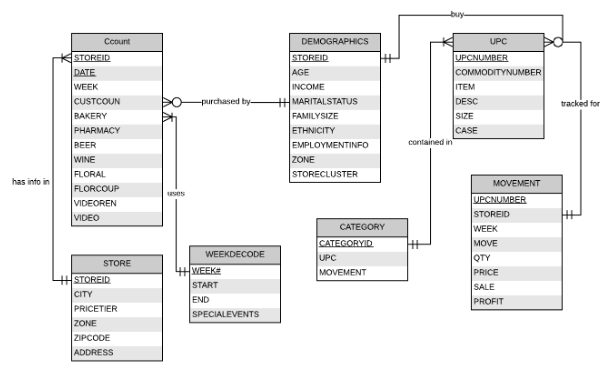
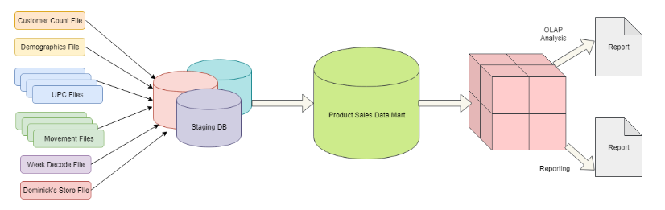
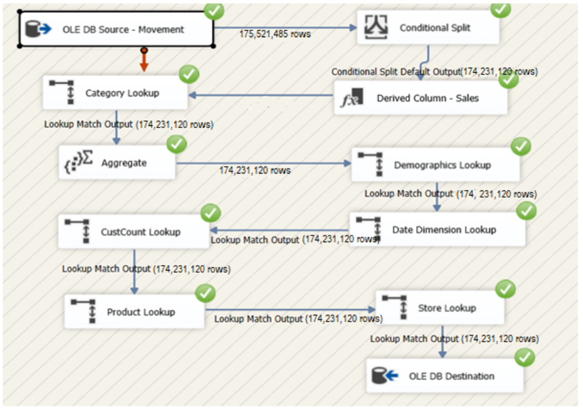

# Dominick Fine Foods
The objective of this project is to present a logical and physical design for Dominick’s Fine Foods. 
We justify why dimensional modeling using Kimball’s methodology is appropriate to address the business requirements. 
We have presented the logical model using star schema that satisfies the requirement to answer the selected business questions. 
Additionally, we have justified how the proposed schema satisfies the business needs and how the schema aligns with the requirement. We also present the physical design based on the data aggregate plan, indexing plan, data standardization plan, and storage plan. Finally, we describe the implementation steps involved in designing the data warehouse using the extraction, cleansing, transformation and load procedures.

## Tools Used
- Microsoft SQL Server
- Microsoft Analysis Server
- Microsoft Reporting Server
- Report Builder 3.0

## ERD

## Business Questions
1. What is the sales trend for Thanksgiving week each year? Which products had the highest sale over the years during this time?
2. What is the impact of age-wise regional demography on the sales of pharmacy products?
3. What is the effect of coupon promotions on the sale of different products store-wise? Do coupons impact product sales?
4. What is the customer increase or decrease over years based on the store?
5.  How are the product category profits changing in every store over the years? What are the product categories with the highest and least profits?

## ETL 

## SSAS

## Datawarehouse Schema
Dimensions dim_date, dim_product and dim_store have auto-generated surrogate keys namely date_key, product_key and store_key which are referenced in fact table fact_product_sales. The combination of keys date_key, product_key and store_key are composite primary key for the fact table.

